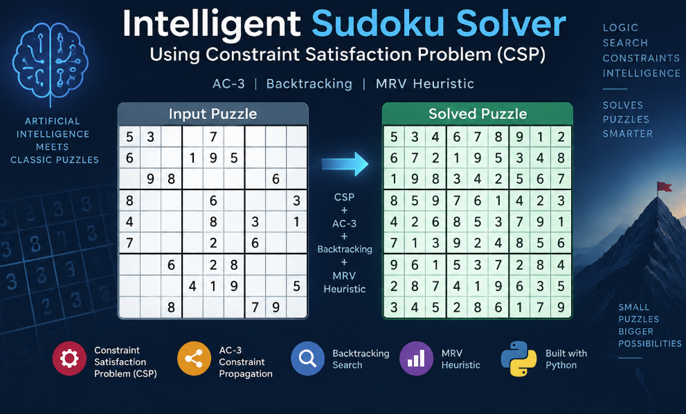

# Intelligent Sudoku Solver using CSP



An Artificial Intelligence based Sudoku solver implemented using Constraint Satisfaction Problem (CSP) techniques.

## Features

- Constraint Satisfaction Problem (CSP) Modeling
- AC-3 Arc Consistency Algorithm
- Backtracking Search
- MRV (Minimum Remaining Values) Heuristic
- Forward Checking
- Performance analysis using node expansion and backtracking count

## Algorithms Used

### Constraint Satisfaction Problem (CSP)

Sudoku is represented as:

- Variables: 81 cells
- Domains: Possible values (1-9)
- Constraints:
  - Row uniqueness
  - Column uniqueness
  - 3×3 box uniqueness


### AC-3 Algorithm

Used for preprocessing by removing inconsistent values from domains before search.


### Backtracking Search

Recursively assigns values and backtracks when a conflict occurs.


### MRV Heuristic

Selects the cell with the smallest remaining domain to reduce search complexity.


## How to Run

```bash
python search.py